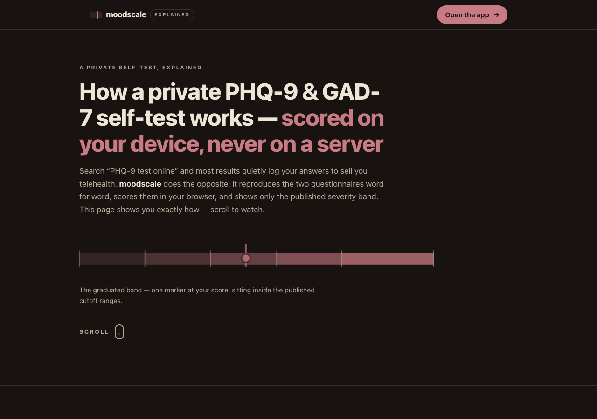

# moodscale explained

**An animated, single-page walkthrough of how a private PHQ-9 & GAD-7 self-test works.**
This page tells the story behind [**moodscale**](https://sreenivas-sadhu-prabhakara.github.io/moodscale/):
why a private mental-health screening tool is worth having, and exactly how it scores the
public-domain PHQ-9 and GAD-7 questionnaires entirely in your browser — reporting only the
*published* severity band, never an interpretation.

It is a distinct deliverable from the app: **this repo is the explainer, not the test.**

## Take the test

This page only explains the tool. To actually take the PHQ-9 or GAD-7:

**➡ [Open moodscale (the live app)](https://sreenivas-sadhu-prabhakara.github.io/moodscale/)**

## What the page walks through

1. **The hook** — the graduated severity band, drawn live, with one marker landing at a score.
2. **The real problem** — most "free online tests" post your answers to a server and gate the
   result behind an email; moodscale does the opposite.
3. **How it works (4 steps)** —
   - the exact questionnaire, reproduced verbatim, with the four published 0–3 options;
   - scoring as **pure addition**, then the marker sliding to where the total falls in the
     published cutoff ranges (a PHQ-9 of 13 → *Moderate*, cited to Kroenke, Spitzer & Williams, 2001);
   - the **calm crisis panel** that surfaces above the score when the PHQ-9 self-harm item isn't zero;
   - the **private trend chart**, shaded with the same published cutoffs as the scorer.
4. **The privacy guarantee** — an animation of `connect-src 'none'` blocking every outbound
   request before it leaves the browser.
5. **A short feature tour** and a prominent **call to action** linking to the live app.

## Design & engineering

- **Zero dependencies, zero build step.** Plain `index.html` + `styles.css` + a tiny `app.js`.
  Every animation is CSS + inline SVG; the only JavaScript adds a class when a section scrolls
  into view (via `IntersectionObserver`).
- **Enforced privacy, even here.** A strict Content-Security-Policy sets `connect-src 'none'`,
  so this page — like the app it describes — cannot make a single network request. No fonts,
  no CDN, no analytics, no trackers. Everything is same-origin.
- **Accessible.** WCAG-AA contrast in both light and dark schemes; a skip link; keyboard-operable;
  visible focus rings; state is never conveyed by colour alone (checks/crosses and labels).
- **`prefers-reduced-motion` respected.** With reduced motion requested, every animation
  collapses to its final, legible static state — nothing depends on movement to be understood.
- **Shared visual identity.** Bone + oxblood palette and the laboratory-ruler *graduated band*
  motif, carried through the page, the OG card, and the icon, so the explainer and the app read
  as a family.

## Quickstart

Just open `index.html` in any modern browser — no server needed for the page itself. (To
regenerate the preview/OG images, serve the folder on a local port; the strict CSP treats a
`file://` origin as opaque and blocks `styles.css`.)

## Disclaimer

This page explains a **screening tool**; it is not the test and not medical advice. The PHQ-9
and GAD-7 are screening questionnaires, **not diagnostic tests** — only a qualified clinician
can diagnose depression or anxiety. This is **not a crisis service**; helpline numbers change
and were verified on the app's stated date. Trend lines shown here are illustrative. This
software is provided under the MIT License, "as is", without warranty of any kind; the author
accepts no liability for any loss, injury, or damage arising from its use.

## License

[MIT](./LICENSE) © 2026 Sreenivas Sadhu Prabhakara
